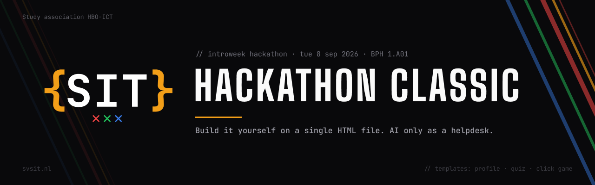

# SIT Hackathon Classic

Starter templates for the Introweek Hackathon of study association SIT (Amsterdam University of Applied Sciences).
The "classic" variant: teams build on a ready-made HTML template themselves. AI is allowed as a helpdesk, not as a generator.

**When:** Tuesday 8 September 2026, 09:30 to 12:30
**Where:** BPH 1.A01
**Access:** walk-in, bring a laptop

## Contents

```
templates/
  profilePage.html         Personal profile page with name, photo placeholder and links (easiest start)
  quiz.html                Working multiple-choice quiz with 3 example questions in an array
  clickGame.html           Browser game "catch the block" with speed, score and lives as variables
```

Every template is a single HTML file with CSS and JS inside. No build step, no install, no account.
Save it, double-click it, it works. Edit in VS Code or Notepad, press F5 to refresh.

## For participants

1. Download a template from `templates/` and open it in your browser.
2. Open the same file in an editor. Look for the lines marked `CHANGE THIS`. Start there.
3. Change a colour or a text, press F5 in the browser. See it change? Then you get the loop.
4. At the bottom of every template there is a list of easy extensions for when you want to go further.

Broke something? Ctrl-Z exists. Or download the template again.

## Live reload (optional)

Tired of pressing F5? Two ways to make the browser refresh by itself every time you save.

**Recommended: Live Server in VS Code.** Install the extension "Live Server" (by Ritwick Dey) from the Extensions tab. Right-click the HTML file and pick "Open with Live Server". Works offline, no terminal, no install beyond the extension.

**If you already have Node installed.** Run this inside the `templates/` folder and open the address it prints:

```
npx live-server
```

Both are optional. F5 in the browser always works, also with Notepad.

## Using the templates outside the hackathon

The templates are deliberately kept simple and are free to reuse for future SIT events or workshops.
They work offline and have no external dependencies.

## License

Internal documentation of study association SIT. Templates may be freely used and adapted.
